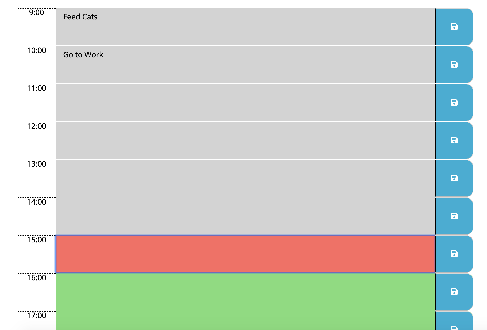

# Day-Planner
https://shelbypalumbo.github.io/Day-Planner/

## User Story
As a student and full time employee, it is important to plan out my day, so that I 
can reference my schedule and ensure that I do not miss a meeting, social events, or simply time alotted to household chores.

## Usage
This application allows a user to write text in to any hour block and save the text to your local storage for future reference.

Background styling classes are added to each time block depending on the time of day. 
As time passes, the hour past turns gray, the current hour block will turn red, and for all of the time blocks following the current hour, they will be green.

### Hourly Color Coding 
* Gray = Passed
* Red = Currrent hour 
* Green = Future hour
